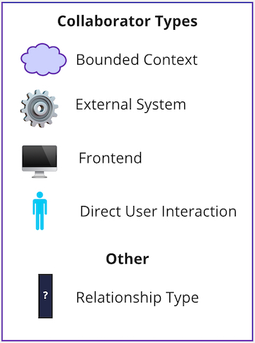
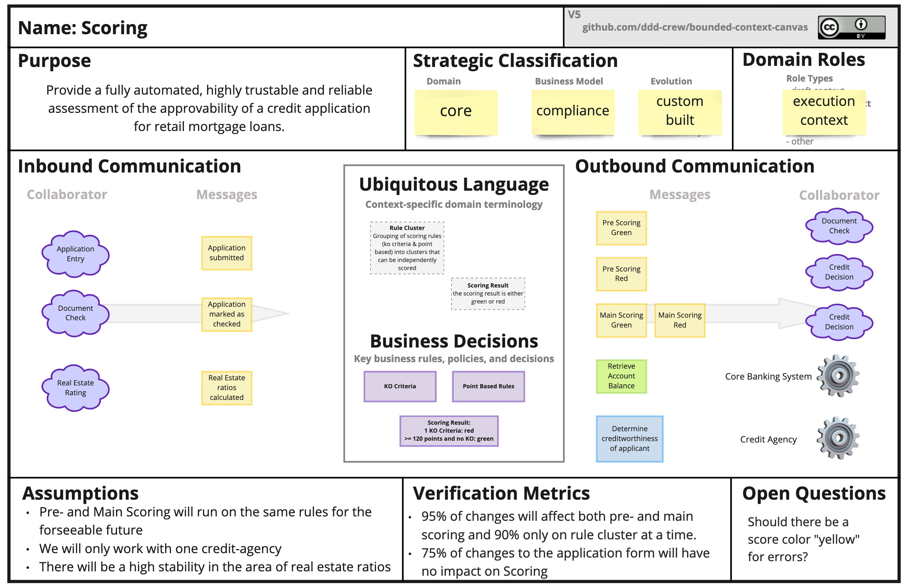

# The Bounded Context Canvas

El **Bounded Context Canvas** es una herramienta colaborativa para diseñar y documentar el diseño de un `Bounded Context`.

Si no está seguro de qué es un `Bounded Context`, puede consultar la [DDD Reference](https://www.domainlanguage.com/ddd/reference/) y [Martin Fowler's article](https://martinfowler.com/bliki/BoundedContext.html).

El Canvas lo guía a través del proceso de diseño de un `Bounded Context` al solicitarle que considere y tome decisiones sobre los elementos clave de su diseño, desde el nombre hasta las responsabilidades, pasando por su interfaz pública y sus dependencias.

## Resumen

- [How to Use](#how-to-use)
- [Section Definition](#section-definitions)
- [Example](#example)
- [Tools](#tools)
- [Design Tips](#design-tips)
- [Additional Resources](#additional-resources)
- [Translations](#translations)
- [Contributors](#contributors)
- [Contributions and Feedback](#contributions-and-feedback)

## How to Use

>Para comenzar rápidamente con el `Bounded Context Canvas`, complete el `canvas` en el orden en que se presentan en [Section Definitions](#section-definitions)

Comience con el `name` y la `description` del `canvas` para aclarar su razón de ser y las responsabilidades clave en una o dos oraciones. Luego, puede completar las otras secciones del `canvas` en cualquier orden. Puede diseñar de afuera hacia adentro comenzando con el `inbound communication` o de adentro hacia afuera comenzando con los `business rules` y `domain language`.

Es posible que no tenga toda la información que necesita para completar ciertas secciones del `canvas`. En tal caso, deberá usar otras técnicas de modelado para encontrar la información que necesita.

### Alternative Formats

El formato predeterminado del `Bounded Context Canvas` que se muestra arriba no es el único formato, a continuación se muestran otros. No dude en experimentar también con formatos nuevos y novedosos.

- [Use Case Swimlanes](https://medium.com/nick-tune-tech-strategy-blog/bounded-context-canvas-recipe-use-case-swimlanes-11ca647175d3): Este estilo organiza la sección de `communication` en carriles que muestran la secuencia en la que ocurren las interacciones utilizando el formato: *message in* -> *decision(s) made* -> *message(s) out*

## Section Definitions

Aquí hay una breve explicación de cada sección del `canvas`.

### Name

Nombrar es difícil. Escribir el nombre de su `context` y lograr un acuerdo como equipo determinará cómo diseñar el `context`.

### Purpose

Unas pocas oraciones que describen el por qué y el qué del contexto en `business language`. No hay detalles técnicos aquí.

Escribir el `purpose` lo obliga a articular claramente los pensamientos difusos y a garantizar que todos en el equipo estén en la misma página.

Describa el `purpose` desde un `business perspective`; también puede nombrar a los `actors` clave para quienes el `bounded context` brinda valor.

### Strategic Classification

**Domain**: ¿Qué importancia tiene este `context` para el éxito de su organización?:

- **core domain**: una iniciativa estratégica clave.
- **supporting domain**: necesario pero no un diferenciador.
- **generic**: una capacidad común que se encuentra en muchos `domains`.

**Business Model**: ¿Qué papel desempeña el `context` en su `business model`?:

- **revenue generator**: las personas pagan directamente por esto.
- **engagement creator**: a los usuarios les gusta pero no pagan por ello.
- **compliance enforcer**: protege la reputación y la existencia de su empresa.

**Evolution**: ¿Qué tan evolucionado está el concepto (consulte Wardley Maps)?:

- **genesis**: nuevo dominio inexplorado.
- **custom built**: las empresas están creando sus propias versiones.
- **product**: existen versiones listas para usar con diferenciación.
- **commodity**: existen versiones altamente estandarizadas.

Para obtener ayuda para completar esta sección del `canvas`, consulte [Core Domain Charts](https://github.com/ddd-crew/core-domain-charts).

### Domain Roles

¿Cómo puede caracterizar el comportamiento de este `bounded context`? 

- **analisys context**: ¿Recibe grandes volúmenes de datos y los procesa para obtener información? 
- **execution context**: ¿Impone un flujo de trabajo? 

Identificar los diferentes roles que desempeña un `context` puede ayudar a evitar la duplicación de responsabilidades.

### Inbound Communication

El `Inbound communication` representa colaboraciones iniciadas por otros `collaborators`.

#### Messages

Los `Messages` son la información que un colaborador envía a otro. Hay tres tipos de conversación que pueden ocurrir entre `bounded contexts`. 
- Un *request* para hacer algo (un `command`), 
- Un *request* de información (un `query`) o 
- Un *notification* de que algo ha sucedido (un `event`).

La palabra `message` se utiliza en sentido general y no está vinculada a ninguna implementación. No es obligatorio ningún *message bus* ni *asynchronous workflow*. Un `command`, por ejemplo, podría simplemente publicar datos desde un formulario HTML como un `command` HTTP POST. 

#### Collaborators

Los `Collaborators` son otros *systems* o *sub-systems* que envían `messages` a este `context`. Pueden ser otros `bounded contexts`, *frontends* (web o mobile) o cualquier otra cosa.

Si el `Bounded Context` posee el *user interface* (por ejemplo, [micro-frontend](https://martinfowler.com/articles/micro-frontends.html)), entonces el tipo de colaborador es la interacción directa del usuario.

#### Relationship Type

El `Relationship Type` entre dos `bounded contexts` indica cómo los `models` y los *teams* se influyen entre sí. Consulta [Context Mappping](https://github.com/ddd-crew/context-mapping) para obtener más información sobre los tipos de relación.

#### Organising Into Swimlanes

Los `collaborators` se pueden organizar en `swim lanes` horizontales que muestran los `messages` que envían.

### Outbound Communication

La `Outbound communication` representa las colaboraciones que se inician en este `context` para interactuar con otros `collaborators`. Se aplican los mismos tipos de `messages` y notaciones que en el `inbound communication`.

### Ubiquitous Language

¿Cuáles son los términos clave del `domain` que existen en este `context` y qué significan?

### Business Decisions

¿Cuáles son las reglas y políticas *key business* dentro de este `context`?

### Assumptions

Nunca tomará decisiones de diseño si tiene un conocimiento completo de todo lo que ocurre en su `domain`. La mayoría de los diseños se basan en `assumptions` y es muy recomendable hacerlos explícitos. Esto se puede hacer en esta sección del diseño del `Bounded Context Canvas`.

### Verification Metrics

`Domain Driven Design` se trata de un enfoque iterativo hacia el modelado y el diseño basado en el *continuous learning*. Las `Metrics` pueden ayudarlo a recopilar información valiosa para esos *learnings* (piense en *build-measure-learn*). Piense en las `metrics` que usted y su *team* pueden definir para recopilar *learnings* sobre si los límites elegidos de su `bounded context` son adecuados o no.

Puede recopilar esas `metrics`, por ejemplo, desde:

- Sus *CI / CD environments*.
- Herramientas como JIRA.
- Desde sus *live systems*.

### Open Questions

Si tiene preguntas que nadie en la sala puede responder mientras se lleva a cabo un *workshop*, puede ingresarlas en esta sección del `canvas`. De esta manera, puede asegurarse de que no se pierda ningun `open questions`, pero también puede obtener un indicador visual de cuán seguro está el equipo con respecto al diseño de un `bounded context` determinado. Muchas `questions` son un buen indicador de un alto grado de incertidumbre.

## Example

A continuación, se muestra una versión completa del `Bounded Context Canvas`.

### Miro Version
A free [MiroHQ template](https://miro.com/miroverse/dps-bounded-context-canvas-for-ddd/) of the Bounded Context Canvas.

