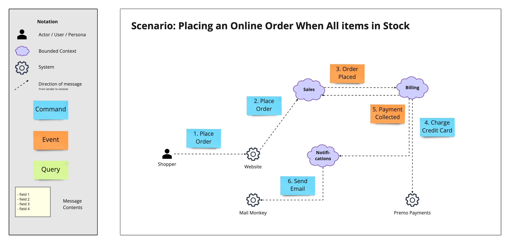
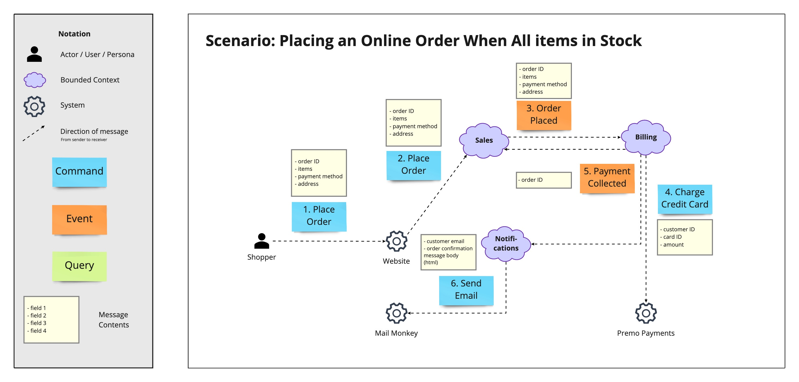
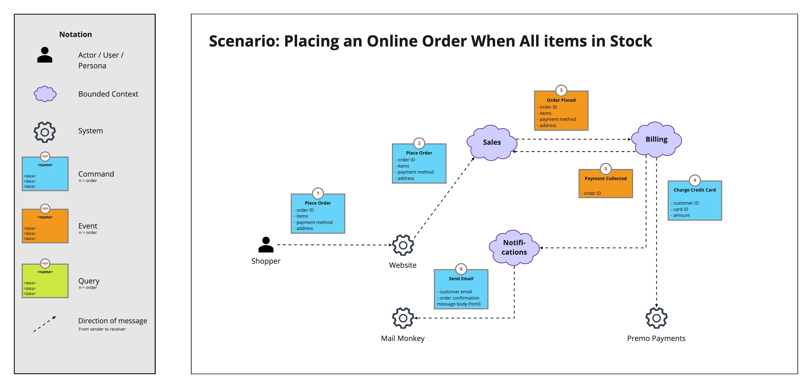
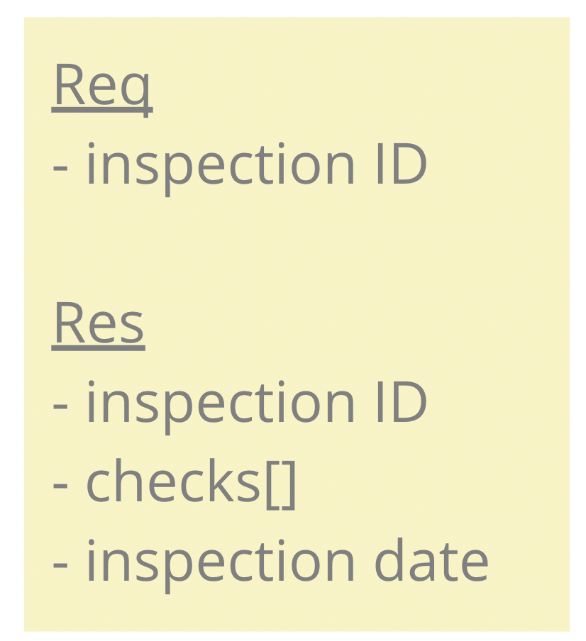
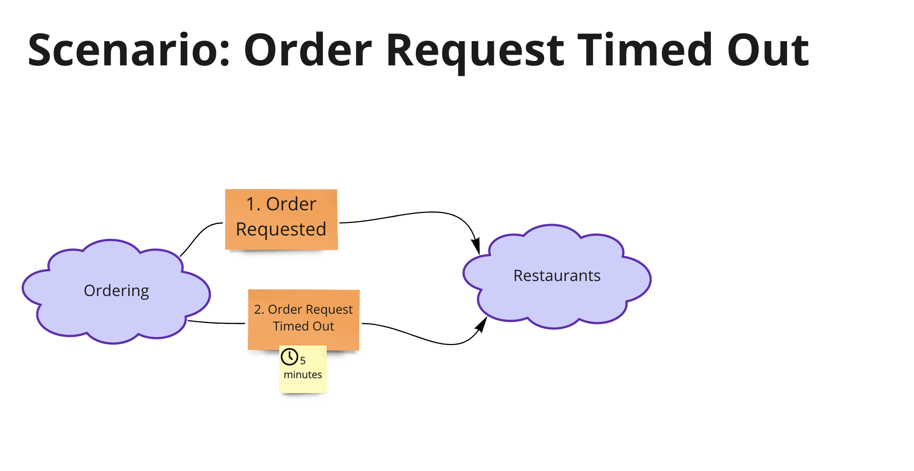

# Domain Message Flow Modelling

El diseño de sistemas débilmente acoplados requiere más que `boundaries` cuidadosamente diseñados. Las interacciones cuidadosamente definidas entre `bounded contexts` son igualmente importantes.

Un [bounded context](https://martinfowler.com/bliki/BoundedContext.html) es un subsistema en una arquitectura de software alineado con una parte del dominio. Puede implementarse como un _microservice_ o un módulo dentro de un _monolith_.

Un `Domain Message Flow Diagram` es una visualización simple que muestra el flujo de mensajes (`commands`, `events`, `queries`) entre `actors`, `bounded contexts`, y `systems`, para un solo escenario.

## Formats

Hay 2 formatos básicos, pero no hay una especificación formal, por lo que debe ajustar la herramienta para que se adapte a sus necesidades si los formatos básicos no funcionan para usted.

### Separate Message & Contents

El formato de `message` y contenido separados utiliza 2 formas para cada `message`: 1 para el nombre y el orden del `message` y un cuadro separado para mostrar el contenido del `message` (la información que contiene).

El beneficio de este formato es que puede concentrarse en el flujo de `message` sin atascarse con el contenido del `message` al principio.

Comience mostrando sólo los `message` que fluyen entre _senders_ y _receivers_ (con el número de orden en el `message`).

A continuación, muestra el contenido de cada `message` en un cuadro separado al lado de cada `message`:

### Combined Message & Contents

El formato combinado de `message` y contenido utiliza una única forma para capturar el _name_, _order_, y _contents_. del `message`.

Este formato es bueno cuando quieres centrarte en el contenido de cada `message` desde el principio.

### Downloads

- [Domain Message Flow Modelling (miro board backup)](assets/miro/Domain-Message-Flow-Modelling-en-v1.rtb)

## How to Use

Cuando tenga un corte inicial de su arquitectura (ha identificado los _candidate_ `bounded contexts`), puede comenzar a diseñar los `message flows`.

Comience por crear una lista de _scenarios_ para modelar. Luego, para cada _scenario_, cree un diagrama.

Al crear un diagrama, el flujo típico es:

1. Comience con un `actor`/`context`/`system`.
2. Cree el `message` que desea enviar.
3. Agregue el _recipient_ del `message` y una línea que conecte al _sender_ y al _receiver_.
4. Coloque el `message` cerca de la línea.
5. Repita los pasos 1 a 4 hasta que su _scenario_ esté completo.

El `message` debe contener 3 elementos:

1. El _name_ del `message`.
2. Los datos significativos contenidos en el `message`.
3. El orden en el que aparece el `message` en el flujo que se está modelando.

Nota: En el caso de un `query`, la _response_ es tan importante como la _request_. La información se puede ver y representar como una unidad, como esta:

## Visualisation Tips

El problema número uno de los `Domain Message Flow Diagrams`, y de los diagramas en general, es el exceso de información. [Miller's Law](https://en.wikipedia.org/wiki/Miller%27s_law) es una buena heurística para utilizar en este caso. El objetivo es tener entre 5 y 9 `message` en el diagrama.

Si descubre que añadir datos a cada `message` interrumpe el flujo de progreso, puede posponer la sección de datos de cada `message` hasta que haya colocado todos los `messages`.

### Time-Dependent Messages

A veces, los `messages` dependen del tiempo. Por ejemplo, escenario: _cancelar un pedido en línea después de 5 minutos de inactividad_. Una visualización como esta podría funcionar bien. Es importante prestar atención a la semántica: _dentro de_, _después_ o _cada 5 minutos_ son condiciones muy diferentes.

## Additional Resources

- [DDD Pattern: Library Contexts](https://medium.com/nick-tune-tech-strategy-blog/ddd-pattern-library-contexts-d6ae81f462ef)
- [Mapper Contexts & Supercontexts: Decoupling Domain-Specific and Domain-Generic Bounded Contexts](https://medium.com/nick-tune-tech-strategy-blog/mapper-contexts-supercontexts-decoupling-domain-specific-and-domain-generic-bounded-contexts-5eb6a1e7c5fc)
- [Gateway Interchange Contexts](https://medium.com/nick-tune-tech-strategy-blog/gateway-interchange-contexts-899696e67848)

## Reference

https://github.com/ddd-crew/domain-message-flow-modelling